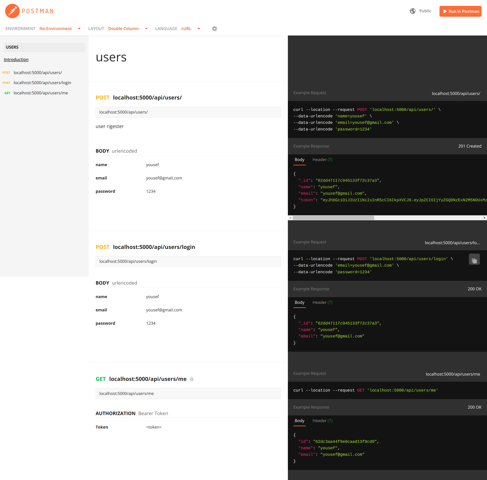
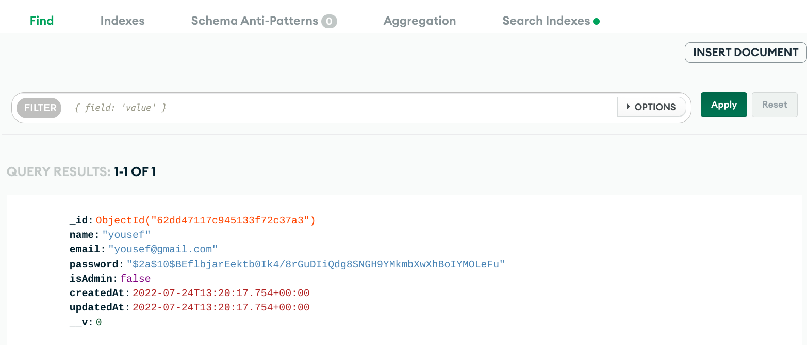

# backend-api

express backend api with jwt authentication, authorization ,error handling, protect routing and connected with mongodb

### Documention

### Database

#### Endpoints

    /api/users          for Register

    /api/users/login    for Login

    /api/users/me       protected route
